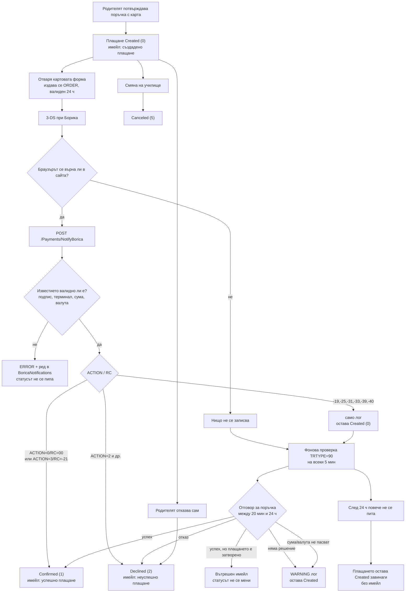

# Борика — какво се случва с едно плащане с карта (пълен доклад)

**Прегледан код:** най-новата версия — клон `fix/borica-f2-late-success` (комит `1d4d7fc`) **плюс** PR #19 (`fix/borica-f3-payments-authorization`, комит `387fc32`). Това е master + PR #20 + PR #21 + предстоящият PR #19.
**Дата на прегледа:** 2026-10-06
**Промени по код:** НЯМА. Това е само четене и сравнение с официалната документация на Борика (`borika-docs.md`).

Докладът е написан така, че да се разбира без технически познания: във всяка таблица има колона „с прости думи“. Техническите означения (`файл:ред`) са само за проверка от разработчик.

---

## 0. Какво влезе в този преглед

| PR / клон | С прости думи какво прави | Основни файлове |
|---|---|---|
| **#20 (F1)** | Променя кои отговори на банката се броят за успех и кои за отказ; кодовете „още тече“ вече не се третират като отказ | `BoricaPaymentGateway.cs`, `BoricaStatusReconciler.cs` |
| **#21 (F2)** | Ако банката вземе парите, след като поръчката вече е отказана/отменена/изтекла, системата пише вътрешен имейл и слага маркер, за да не се повтаря | `BoricaStatusReconciler.cs`, `BoricaPaymentGateway.cs`, `PaymentService.cs`, `PaymentTransaction.cs`, нова миграция `20261006054733_AddLateSuccessAlertedAt` |
| **#19 (F3)** | Затваря дупката: картовата форма вече иска вход и се отваря само от собственика на плащането | `PaymentsController.cs`, `PaymentService.cs` |

---

## 1. Целият поток, стъпка по стъпка

| № | Стъпка | Кога се случва | Какво прави системата | Какво пише в базата | Имейл до родителя | Вътрешен имейл | Какво вижда родителят | Код |
|---|---|---|---|---|---|---|---|---|
| 1 | Създаване на поръчка с карта | родителят потвърждава поръчката | създава плащане и транзакция | нов ред в `Payments` и `PaymentTransactions`, статус `Created (0)` | **„създадено плащане“** (`payment-created-card.html`) | няма | потвърждение, че поръчката е приета | `PaymentService.cs:389` |
| 2 | Отваряне на картовата форма | родителят натиска „Плати с карта“ | иска от банката номер на поръчка (ORDER) и подпис | нов ред в `BoricaOrderSequences`: ORDER, издаден сега, валиден 24 ч | няма | няма | формата, която праща данните към Борика | `BoricaPaymentGateway.cs:91-189` |
| 3 | 3-DS при банката | след въвеждане на картата | банката пита картодържателя (парола/код) | нищо в нашата база | няма | няма | страниците на банката | — |
| 4 | Известие от банката (BACKREF) | веднага след 3-DS **само ако браузърът се върне в сайта** | приема `POST /Payments/NotifyBorica` | нов ред в `BoricaNotifications` | зависи от кода — виж редове 6–10 | зависи от кода | страница `BoricaResult` | `PaymentsController.cs:56-73` |
| 5 | Проверка на известието | в същата заявка | проверява подпис, терминал, а при успех и сума/валута | пази реда, но с `SignatureValid=false`; **статусът на плащането не се пипа** | няма | няма (само лог) | „Плащането се проверява“ | `BoricaPaymentGateway.cs:258-287` |
| 6 | Успех в известието | `ACTION=0` и `RC=00` | плащането става платено | `Payments.PaymentStatus = Confirmed (1)` | **„получено плащане“** (`success-payment-card.html`) | няма | „Плащането е успешно“ | `BoricaPaymentGateway.cs:298-305` |
| 7 | Успех по код `-21` | `ACTION=3` и `RC=-21` („вече е изпълнена“) | също става платено | `Confirmed (1)` | същият имейл за успех | няма | **„Вашето плащане не бе извършено успешно“** — грешен екран, виж находка №3 | `BoricaPaymentGateway.cs:292-305` |
| 8 | Отказ в известието | всеки друг код извън „още тече“ | плащането става отказано | `Declined (2)` | **„неуспешно плащане“** (`payment-canceled.html`) | няма | „Вашето плащане не бе извършено успешно“ + възможни причини | `BoricaPaymentGateway.cs:321-328` |
| 9 | Кодове „още тече“ в известието | `-19, -25, -31, -33, -39, -40` | **не прави нищо, само пише лог** | нищо; статусът остава `Created (0)` | няма | няма | пак твърд отказ: „не бе извършено успешно“ и „не са изтеглени суми“ | `BoricaPaymentGateway.cs:293-297` |
| 10 | Късен успех в известието | успех, а плащането вече е `Canceled/Declined/Expired` | пише лог, слага маркер и праща вътрешен имейл | `PaymentTransactions.LateSuccessAlertedAtUtc = сега` | **няма** (по замисъл клиентът не се уведомява) | „[СПЕШНО] … късно картово плащане“ — **при подразбиране не се изпраща**, виж находка №1 | при `ACTION=0` — „Плащането е успешно“, макар поръчката да е отменена; при `-21` — отказ | `BoricaPaymentGateway.cs:306-319` |
| 11 | Фонова проверка (TRTYPE=90) | на всеки 5 минути, **само ако е включена** | пита банката какво е станало с поръчки между 20 мин и 24 ч | чете `BoricaOrderSequences`; пише само при решение | при решение — виж 12–15 | при късен успех | нищо, фонова е | `BoricaStatusCheckWorker.cs:22-38`, `BoricaStatusReconciler.cs:36-60` |
| 12 | Проверка → успех | по разписание, за плащане в `Created` | потвърждава | `Confirmed (1)` | имейл за успех | няма | нищо | `BoricaStatusReconciler.cs:137,192-197` |
| 13 | Проверка → отказ | по разписание, за плащане в `Created` | отказва | `Declined (2)` | имейл за неуспех | няма | нищо | `BoricaStatusReconciler.cs:138,198-202` |
| 14 | Проверка → късен успех | по разписание, до 24 ч от ORDER | лог + маркер + вътрешен имейл | `LateSuccessAlertedAtUtc = сега`, статусът **не се мени** | няма | „[СПЕШНО] …“ — **при подразбиране не се изпраща** | нищо | `BoricaStatusReconciler.cs:168-186` |
| 15 | Проверка → няма решение | отрицателен код без присъда | пише предупреждение | нищо; остава `Created` | няма | няма | нищо | `BoricaStatusReconciler.cs:139-143` |
| 16 | Проверка → сума/валута не съвпадат | `ACTION=0` или `2`, но полетата не пасват | пише предупреждение **и спира** | нищо; остава `Created` | няма | няма | нищо | `BoricaStatusReconciler.cs:152-158` |
| 17 | **След 24 часа** | ORDER по-стар от 24 ч | **спира да пита изобщо** | нищо | няма | няма | „Очаква плащане“ **завинаги** | `BoricaStatusReconciler.cs:43`, `borika-docs.md:275` |
| 18 | Родителят отказва сам | от страницата на плащането | отказва плащането | `Declined (2)`; платеното от сметката на детето се връща | **„неуспешно плащане“** | няма | страницата на плащането | `ParentController.cs:154-159`, `PaymentService.cs:589-620` |
| 19 | Смяна на училище в друга фирма | когато столът/фирмата се сменят | връща избраните дни и отменя чакащите плащания | `Canceled (5)`; остатъкът от `child.Money` отива в `ChildMovedOutstandingMoney` | няма | няма | нищо | `CanteenManagmentService.cs:802-823`, `PaymentService.cs:747-756` |
| 20 | Epay (за сравнение) | друг картов доставчик | при изтекло време плащането става `Expired` | `Expired (4)` | **„изтекло време за плащане“** (`payment-expired.html`) | няма | страницата на Epay | `EpayPaymentGateway.cs:167-184` |
| 21 | Карта и статус `Expired` | никога | при карти `Expired` не се задава — този път съществува само при Epay | нищо | няма | няма | — | `EpayPaymentGateway.cs:183-184` |

---

## 2. Потокът на една графика

---

## 3. Статусите на плащането

| Стойност | Какво значи | Кой път го задава | С какво влиза/излиза |
|---|---|---|---|
| **0 Created** | „Очаква плащане“ | начален статус при създаване | може да стане 1, 2 или 5 |
| **1 Confirmed** | платено | известие или фонова проверка | краен успех + имейл |
| **2 Declined** | отказано | известие, фонова проверка или ръчен отказ на родителя | праща имейл; връща платеното от сметката на детето |
| **3 Reversed** | сторнирано | **никой — не се задава никъде в приложението** | само фигурира в списъка |
| **4 Expired** | изтекло време | **само Epay**; при карти не се стига | праща имейл при Epay |
| **5 Canceled** | отменено | само `CancelWaitingForChild` при смяна на училище | — |

---

## 4. Кодовете от банката — какво правим

| Код | Какво значи | Какво прави системата | Източник |
|---|---|---|---|
| `ACTION=0, RC=00` | успешно приключила трансакция | платено + имейл за успех | `borika-docs.md:557,707` |
| `ACTION=3, RC=-21` | трансакцията вече е изпълнена (парите са взети) | брои се за успех, **но без проверка на сумата** | `borika-docs.md:1852` |
| `ACTION=2` | отказана от издателя на картата | отказано + имейл | `borika-docs.md:557,708` |
| `RC=-25` | допълнителното потвърждение е отказано от картодържателя | **в известието — „още тече“; в проверката — отказ** (разминаване) | `borika-docs.md:1856` |
| `RC=-19` | неуспешна автентикация | в известието само лог; в проверката — отказ | `borika-docs.md:1850` |
| `RC=-31, -33, -39, -40` | тече обработка / чака се клиентът | в известието само лог; в проверката след 20 мин — отказ | `borika-docs.md:710-713` |
| `RC=-32` | дублирана отказана трансакция | отказ + имейл | `BoricaStatusReconciler.cs:138` |
| Друг отрицателен код | APGW е отхвърлил самата ни заявка (лош подпис, несъвпадаща валута и др.) | плащането остава `Created` + предупреждение | `borika-docs.md:1855` |

---

## 5. Имейлите

| Имейл | Кога се праща | До кого | Подател | Шаблон |
|---|---|---|---|---|
| Създадено плащане | при създаване на плащане с карта | родителят | support@e-stol.com | `content/mails/payment-created-card.html` |
| Успешно плащане | при `Confirmed` (известие или проверка) | родителят | support@e-stol.com | `content/mails/success-payment-card.html` |
| Неуспешно плащане | при `Declined` (от банката или ръчно) | родителят | support@e-stol.com | `content/mails/payment-canceled.html` |
| Изтекло време | само при Epay | родителят | support@e-stol.com | `content/mails/payment-expired.html` |
| **Късен успех (ново)** | когато парите са взети, а поръчката е затворена | `OperationsEmail`, по подразбиране **support@e-stol.com** | support@e-stol.com | тяло, вградено в кода |

**Важно:** `MailSender` (общата функция за пращане) **тихо пропуска всяко писмо, чийто получател съдържа `@e-stol.com` и не е точно `admin@e-stol.com`** — `MailSender.cs:91-92`. Затова вътрешният имейл за късен успех, чийто адрес по подразбиране е `support@e-stol.com`, изобщо не тръгва.

---

## 6. Къде може да „заседне“ едно плащане

| Крайно състояние | Как се стига дотам | Какво остава | Какво вижда родителят | Имейл |
|---|---|---|---|---|
| Платено (`Confirmed`) | успех по известие или проверка | всичко е приключено | „Плащането е успешно“ | пратен |
| Отказано (`Declined`) | отказ по известие, проверка или ръчен отказ | платеното от сметката на детето се връща | „…не бе извършено успешно“ | пратен |
| Отменено (`Canceled`) | смяна на училище | плащанията са отменени, остатъкът е прехвърлен | нищо | не |
| **Заседнало в „Очаква плащане“** | браузърът не се върна, проверката е изключена или пада на сума/валута | ORDER изтича след 24 ч и **системата спира да проверява**; статусът остава `Created` завинаги | „Очаква плащане“ безкрайно | не |
| **Пари взети, поръчка затворена** | банката потвърждава късен успех | статусът нарочно не се променя; слага се маркер | при `ACTION=0` вижда „Плащането е успешно“ (макар поръчката да е отменена), при `-21` — отказ | само вътрешен — **и той не тръгва** |

---

## 7. Находки (проверени в кода)

| № | Сериозност | Какво не е наред | Кога се задейства | Какво се чупи | Как се поправя | Доказателство |
|---|---|---|---|---|---|---|
| 1 | **висока** | Вътрешният имейл за късен успех **не се изпраща никога** с настройките по подразбиране | всеки късен успех (известие или проверка) | `OperationsEmail` по подразбиране е `support@e-stol.com`, а `MailSender` пропуска всеки получател `@e-stol.com` освен `admin@`; маркерът вече е сложен, значи и повторен опит няма — никой не разбира, че парите са взети | да се зададе вътрешен адрес извън `@e-stol.com` (настройка `Borica__OperationsEmail`) или изрично да се разреши този адрес в `MailSender` | `BoricaSettings.cs:25`, `PaymentService.cs:1026`, `MailSender.cs:91-92` |
| 2 | **висока** | Маркерът за уведомяване се записва **преди** изпращането на имейла | късен успех при проблем с пощата (SMTP) | при грешка известието се губи завинаги, защото след това транзакцията вече не е кандидат за проверка | маркерът да се вдига само след успешно изпращане (или да има повторен опит) | `BoricaPaymentGateway.cs:313-317,330`, `BoricaStatusReconciler.cs:177-181,208-211` |
| 3 | **висока** | Родителят вижда **грешен екран** за резултата | при `-21` (успех) плащането е платено, а екранът пише отказ; при „още тече“ екранът пише твърд отказ с „не са изтеглени суми“; при късен успех на отменена поръчка екранът пише „Плащането е успешно“ | родителят може да плати втори път или да остане с грешно впечатление | екранът да се определя по реалния статус и по кода: успех/отказ/**„проверява се“** със съответния текст | `PaymentsController.cs:83-91`, `Views/Payments/BoricaResult.cshtml:8-22` |
| 4 | средна | Код `ACTION=3, RC=-21` потвърждава плащане **без проверка на сумата и валутата** | при `-21` | плащане може да се потвърди, без да се сравни какво е платено | когато банката върне сума и валута, да се сравняват и при този код | `BoricaPaymentGateway.cs:249-255,292`, `BoricaStatusReconciler.cs:137,152` |
| 5 | средна | Един и същ код (`-25`) дава различен изход по двата пътя | код `-25`/`-19` по известие | по известие плащането остава „чакащо“ без имейл, по проверка става отказано с имейл; родителят вижда отказ веднага | едно значение на кода според документацията и еднакво третиране | `BoricaPaymentGateway.cs:293` срещу `BoricaStatusReconciler.cs:138`, `borika-docs.md:1850,1856` |
| 6 | средна | **След 24 часа резултат не може да се научи** | успешно плащане, при което браузърът не се върна до 24 ч | пари могат да са взети, поръчката да стои като незавършена и никой никога да не разбере (и Борика пази данните само 24 ч) | ръчна сверка с извлеченията от банката или по-дълъг срок, ако терминалът го позволява | `BoricaStatusReconciler.cs:43`, `BoricaPaymentGateway.cs:157`, `borika-docs.md:275` |
| 7 | средна | Невалидно известие не уведомява никого (само лог в сървъра) | лош подпис, друг терминал, несъвпадаща сума/валута | при опит за манипулация или софтуерен дефект няма имейл/сигнал; логът дори не казва кое поле не пасва | вътрешно известие при `SignatureValid=false` и подробен лог (получено срещу очаквано) | `BoricaPaymentGateway.cs:258-287`, `BoricaStatusReconciler.cs:151` |
| 8 | средна | Отмяната при смяна на училище не пипа транзакциите и сметката на детето | дете с чакащо плащане, частично платено от `child.Money`, се мести в друга фирма | възможно е пари да не се върнат/прехвърлят коректно; съседните методи го правят | да се ползва логиката на `CancelPayment`; **задължително да се провери на живо с реален случай** | `PaymentService.cs:747-756` срещу `:560-588`, `CanteenManagmentService.cs:802-823` |
| 9 | средна | **Твърдо записани потребител и парола за пощата в изходния код** | всеки път | всеки с достъп до кода може да праща писма от името на e-stol (не е ново от тези PR-и, но е сериозно) | да се изнесат в настройки/секрети и ключът да се смени | `MailSender.cs:96` |
| 10 | ниска | Статус `Reversed (3)` не се използва никъде | — | подвежда при четене на данните (изглежда като възможен, а не се стига до него) | или да се реализира сторниране, или да се махне от списъка | `src/EStol.Domain/Enums/PaymentStatus.cs` |
| 11 | ниска | PR #19 (F3) засяга и Epay, и не предвижда втори родител | плащане през Epay или друг настойник, който не е собственик | `[Authorize]` е сложен на `Index`, който обслужва и Epay; при втори настойник има 403 | да се проверят външните линкове към `/Payments/Index` и да се реши дали настойник трябва да има достъп | `git show 387fc32 -- src/EStol.Web/Controllers/PaymentsController.cs` |

### Проверени и отхвърлени съмнения (за да не се губи време)

| Съмнение | Присъда | Защо |
|---|---|---|
| „В продукцията фоновата проверка е изключена, защото в `appsettings.json` пише `Enabled: false`“ | **отхвърлено** | `src/EStol.Web/appsettings.json` е **локален, непрехвърлян файл** (в `.gitignore`); в хранилището го няма, а на сървъра настройките идват само от променливите на средата. Че проверката работи на stage, се вижда от лога, който собственикът показа. |
| „При код „още тече“ страницата пише „Успешно плащане““ | **отхвърлено** (но има друг проблем) | `GetBoricaResult` връща успех само при `ACTION=0/RC=00`; при „още тече“ страницата пише твърд отказ — виж находка №3. |
| „PR #19 ще върне 403 на всички, защото чете грешен claim“ | **отхвърлено** | `UserPrincipalFactory.cs:14` издава точно `ClaimTypes.NameIdentifier` = id на потребителя, а `[Authorize]` разчита на конфигурираната cookie схема в `Program.cs`. Проверката за собственост работи. |
| „Имейлите се дублират“ | **отхвърлено** | всеки преход е защитен с проверка статусът да е `Created`, а известието и проверката работят в серийна транзакция — всеки имейл може да излезе най-много веднъж. |

---

## 8. Какво не може да се определи от кода (нужна е жива проверка)

| Въпрос | Как се проверява |
|---|---|
| Какъв точно отговор дава банката за конкретна поръчка (напр. 075582) | ръчна заявка `TRTYPE=90` за съответния ORDER и терминал; суровият отговор показва `ACTION`, `RC`, `AMOUNT`, `CURRENCY` |
| Каква е стойността на `Borica__OperationsEmail` в stage и в продукция | `printenv` в контейнера, търсене на `Borica` |
| Дали `-25` и `-19` наистина се считат за отказ по договора с Борика | потвърждение от банката/търговския отдел, документацията е двусмислена |
| Дали при плащане, частично от сметката на детето, смяната на училище връща парите коректно | реален тест на stage с такова плащане |
| Дали някой външен линк (имейл, отметка) води директно към `/Payments/Index/{id}` | преглед на шаблоните на имейлите |

---

## 9. Източници

- Код: `E:\Projects\e-stol\e-stol-n10\EStol` — клон `fix/borica-f2-late-success` (`1d4d7fc`) + PR #19 (`387fc32`)
- Официална документация на Борика: `local-docs/borica-implementation-docs/borika-docs.md`
- Предишни документи: `BORICA-STATUS-CHECK-PLAN.md`, `BORICA-VERIFICATION-PROMPT.md`, `BORICA-FIX-PLAN-PROMPT.md`, `borica-transaction-map.html`
